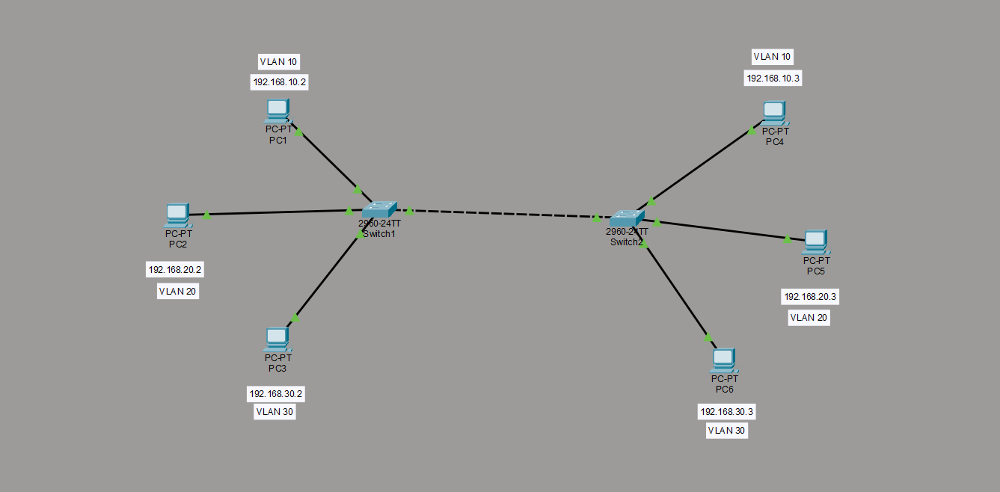

# Lab 01 - VLANs & Trunking

## Objective

Build a two-switch network with VLAN segmentation and 802.1Q trunking to demonstrate Layer 2 isolation between VLANs and proper inter-switch VLAN communication, while applying trunk security hardening to mitigate VLAN hopping risks.

## Topology

Two Cisco 2960 switches, each connected to 3 end devices across 3 VLANs, linked via a trunk port.

## VLAN Plan

| VLAN | Name | Subnet | Devices |
|---|---|---|---|
| 10 | Sales | 192.168.10.0/24 | PC1 (SW1), PC4 (SW2) |
| 20 | IT | 192.168.20.0/24 | PC2 (SW1), PC5 (SW2) |
| 30 | Management | 192.168.30.0/24 | PC3 (SW1), PC6 (SW2) |

`.1` reserved on each subnet for future router gateway (Phase 2).

## What Was Configured

**Base Configuration**
- Hostname, enable secret, console and VTY line passwords, banner MOTD

**VLANs**
- VLANs 10, 20, 30 created on both switches
- Access ports assigned per VLAN with descriptions

**Trunking**
- 802.1Q trunk configured between SW1 and SW2 (Fa0/24)
- `switchport nonegotiate`: disabled DTP to prevent switch spoofing
- Native VLAN changed to VLAN 99: mitigates double-tagging VLAN hopping attacks
- Trunk restricted to allowed VLANs only (`10,20,30`): reduces unnecessary VLAN exposure

## Verification & Results

| Test | Result | Explanation |
|---|---|---|
| PC1 (VLAN 10, SW1) → PC4 (VLAN 10, SW2) | Success | Confirms trunk correctly carries VLAN 10 traffic between switches |
| PC1 (VLAN 10) → PC5 (VLAN 20) | Fails - packet never leaves PC1 | No default gateway configured yet; confirms VLAN isolation at Layer 2 |

## What I Learned

- Trunking and inter-VLAN routing solve two different problems - trunking transports VLAN-tagged traffic between switches, it does not route between VLANs
- A host will not even attempt to send traffic outside its own subnet without a configured default gateway - the packet dies locally
- Changing the native VLAN away from VLAN 1 and disabling DTP negotiation are simple, low-cost steps that meaningfully reduce VLAN hopping attack surface
- `show interfaces trunk` and `show vlan brief` are the primary verification commands for confirming Layer 2 segmentation is working as intended

## Next Steps

Phase 2 will introduce a router for inter-VLAN routing, enabling controlled communication between VLANs 10, 20, and 30.
